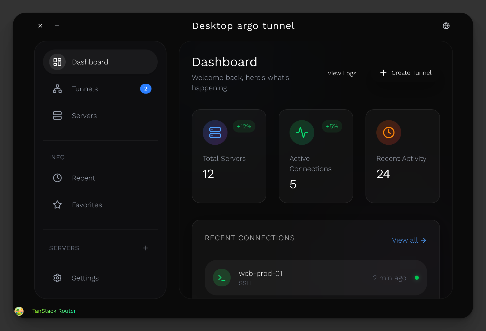

# Desktop Argo Tunnel Manager

> A modern, professional GUI for managing Cloudflare Tunnels and remote server connections

[](LICENSE)
[]()
[]()

<a href="https://www.producthunt.com/products/desktop-cloudflare-tunnel-ui?embed=true&utm_source=badge-featured&utm_medium=badge&utm_source=badge-desktop&#0045;cloudflare&#0045;tunnel&#0045;ui" target="_blank"></a>

## Overview

**Desktop Argo Tunnel Manager** is a desktop application that provides a graphical interface for managing `cloudflared access` connections. Connect to remote services (SSH, RDP, TCP) through Cloudflare's secure network with automatic local port forwarding.

### Why Use This Application?

- **No Command Line Required**: All `cloudflared access` functionality through a beautiful GUI
- **Automatic Port Management**: Random local port assignment for each connection
- **One-Click Connections**: Connect to SSH, RDP, and TCP services instantly
- **Centralized Management**: Manage all your servers and active tunnels from a single dashboard
- **Secure & Local**: All credentials stored locally with encryption
- **Multi-Language**: Full support for English and Russian

## Features

### Core Capabilities

- **Active Connection Management**
  - View all running TCP tunnels in real-time
  - Monitor local ports and process IDs
  - Stop tunnels with one click
  - Automatic port assignment (10000-60000 range)
  
- **Server & Service Management**
  - Organize servers by groups/companies
  - Support for SSH, RDP, and TCP protocols
  - Secure credential storage
  - One-click connection via `cloudflared access tcp`
  - Automatic tunnel creation on connect

- **Dashboard & Analytics**
  - Real-time connection statistics
  - Recent activity tracking
  - Connection health monitoring
  - Quick access to favorites

### Modern UI/UX

- **Premium Design**: Glassmorphism effects, gradients, and smooth animations
- **Dark Theme**: Optimized for long working sessions
- **Responsive Layout**: Adapts to different window sizes
- **Keyboard Shortcuts**: Power-user friendly with command palette (Cmd/Ctrl+K)

### Internationalization

- English (default)
- Russian
- Easy to add more languages

## Screenshots

### Dashboard


## Installation

### Prerequisites

- **Cloudflared**: The application requires `cloudflared` binary to be installed
  ```bash
  # macOS
  brew install cloudflared
  
  # Windows
  winget install Cloudflare.cloudflared
  
  # Linux
  wget -q https://github.com/cloudflare/cloudflared/releases/latest/download/cloudflared-linux-amd64.deb
  sudo dpkg -i cloudflared-linux-amd64.deb
  ```

### Download & Install

1. Download the latest release for your platform from [Releases](../../releases)
2. Install the application:
   - **macOS**: Open the `.dmg` file and drag to Applications
   - **Windows**: Run the `.exe` installer
   - **Linux**: Install the `.deb` or `.AppImage` package

## Quick Start

1. **Launch the Application**
   - The dashboard will show your current infrastructure status

2. **Add Your First Server**
   - Click "Add Server" in the sidebar
   - Enter server details (name, host, port, protocol)
   - Save credentials if needed

3. **Connect to a Service**
   - Navigate to the "Servers" tab
   - Select a server from the list
   - Choose a service (SSH, RDP, or TCP)
   - Click "Connect"
   - The application will:
     - Automatically assign a random local port (10000-60000)
     - Start a `cloudflared access tcp` tunnel
     - Display the local port in the service details

4. **View Active Connections**
   - Navigate to "Active Connections" tab
   - See all running tunnels with their local ports and PIDs
   - Stop tunnels when no longer needed

## Architecture

### Technology Stack

**Frontend**
- React 18 with TypeScript
- TanStack Router for routing
- Tailwind CSS for styling
- Framer Motion for animations
- i18next for internationalization

**Backend**
- Rust with Tauri 2.0
- Native OS integration
- Secure IPC communication
- Process management for `cloudflared`

**Core Integration**
- `cloudflared` binary for tunnel operations
- Native SSH/RDP client integration
- Secure credential storage using OS keychain

### Project Structure

```
desktop-argo-tunnel/
├── src/                    # Frontend source
│   ├── components/         # React components
│   ├── routes/            # Route definitions
│   ├── i18n/              # Translations
│   └── store.ts           # State management
├── src-tauri/             # Rust backend
│   ├── src/
│   │   ├── main.rs        # Entry point
│   │   └── cloudflared/   # Cloudflared integration
│   └── Cargo.toml
├── docs/                  # Documentation
└── public/                # Static assets
```

## Development

### Prerequisites

- Node.js 18+ and pnpm
- Rust 1.70+
- Tauri CLI

### Setup

```bash
# Clone the repository
git clone <repository-url>
cd desktop-argo-tunnel

# Install dependencies
pnpm install

# Run in development mode
pnpm tauri dev

# Build for production
pnpm tauri build
```

### Available Scripts

- `pnpm dev` - Start Vite dev server
- `pnpm build` - Build frontend
- `pnpm tauri dev` - Run Tauri in development mode
- `pnpm tauri build` - Build production application

## Configuration

The application stores configuration in:
- **macOS**: `~/Library/Application Support/com.desktop-argo-tunnel`
- **Windows**: `%APPDATA%\desktop-argo-tunnel`
- **Linux**: `~/.config/desktop-argo-tunnel`

### Settings

Access settings via the Settings tab to configure:
- Language preference
- Cloudflared binary path
- Default tunnel configurations
- Connection timeouts
- Log levels

## Cloudflared Integration

This application provides a GUI for the following `cloudflared` commands:

| CLI Command | GUI Equivalent |
|-------------|----------------|
| `cloudflared access ssh` | Connect to SSH Service |
| `cloudflared access rdp` | Connect to RDP Service |
| `cloudflared access tcp` | Connect to TCP Service |

## Troubleshooting

### Application won't start
- Ensure `cloudflared` is installed and in PATH
- Check application logs in the config directory

### Tunnel creation fails
- Verify Cloudflare account credentials
- Check internet connectivity
- Review tunnel logs in the Logs tab

### Connection issues
- Verify server host and port are correct
- Check firewall settings
- Ensure `cloudflared` has necessary permissions

For more help, see [docs/USER_GUIDE.md](docs/USER_GUIDE.md)

## Planned Features
- **Native RDP Integration**: Automatically launch `mstsc` (Remote Desktop Connection) with the target host pre-configured upon connection.
- **Native SSH Integration**: Automatically launch `putty` with the target host pre-configured for SSH connections.
- **Credential Management**: Securely save and auto-fill login credentials (username, password, domain) for both `mstsc` and `putty` sessions.

## Contributing

Contributions are welcome! Please read our contributing guidelines before submitting PRs.

## License

This project is licensed under the MIT License - see the [LICENSE](LICENSE) file for details.

## Acknowledgments

- Built with [Tauri](https://tauri.app/)
- Powered by [Cloudflare Tunnels](https://www.cloudflare.com/products/tunnel/)
- UI inspired by modern design systems

---

**Made for simplified tunnel management**
